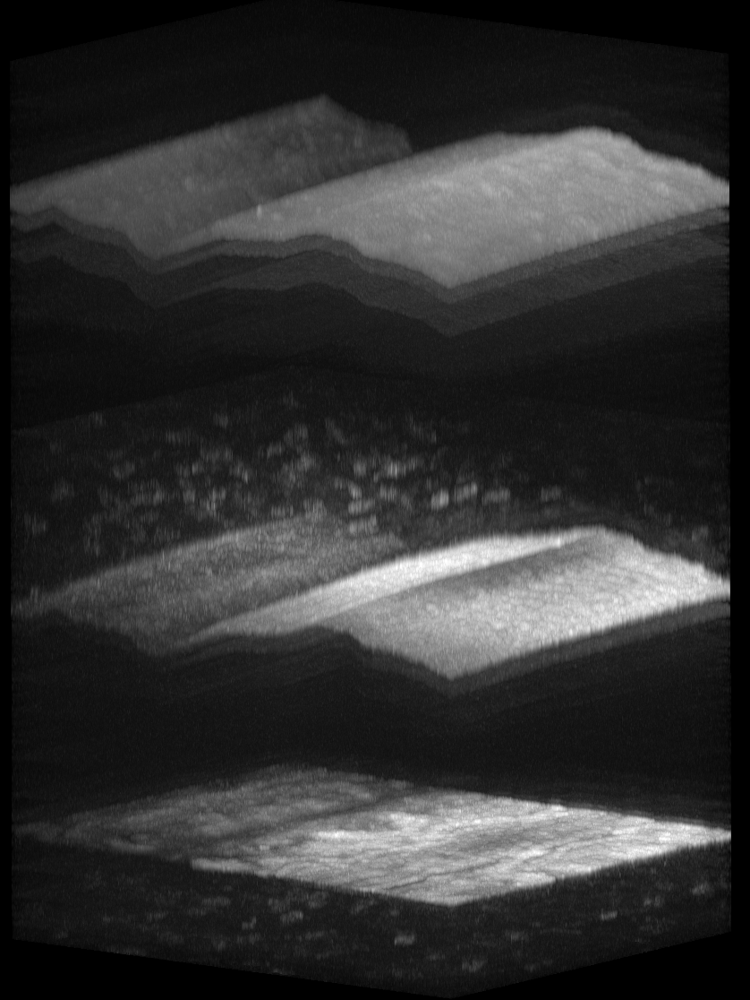
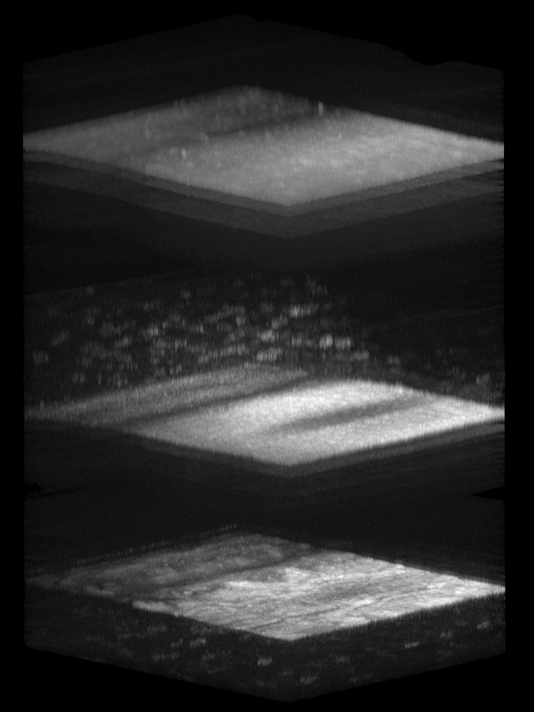

# OCT Processing Framework

## Overview

This project provides a comprehensive framework for processing Optical Coherence Tomography (OCT) volumes. The framework focuses on providing both a user-friendly Graphical User Interface (GUI) and command-line tools for batch processing. It aims to correct for distortions and motion artifacts in OCT images, improving their quality and enabling more accurate analysis through advanced image processing techniques, deep learning models, and optimization algorithms.

Standalone applications for macOS and Windows are also available for download from our GitHub releases, providing a convenient way to use the framework without installing Python or other dependencies.

### Preview


| **Before Registration** | **After Registration** |
|------------------------|------------------------|
|  |  |

## Key Features

*   **Feature Detection:** Employs a YOLO model to detect anatomical features and structures in OCT images
*   **Multi-dimensional Motion Correction:** Corrects motion in X, Y, and Z (flattening) directions
*   **Deep Learning Integration:** Utilizes Swin Transformer-based "TransMorph" model for registration
*   **Flexible Configuration:** GUI allows real-time configuration of processing parameters; command-line interface uses YAML configuration files
*   **Dual Interface:** Provides both GUI (PySide6) and command-line interfaces for different use cases
*   **Multi-format Support:** Supports `.h5`, DICOM (`.dcm`), and single-scan raw binfile OCT data
*   **Batch Processing:** GUI supports batch processing of multiple volumes; command-line interface includes SLURM multiprocessing capabilities for handling large datasets efficiently
*   **Standalone Applications:** Pre-built macOS and Windows applications available for easy deployment without Python installation

## Installation

**Prerequisites:**
- This project requires Python 3.12. Please ensure you have Python 3.12 installed before proceeding.
- Rust (latest stable version) is required for building performance-critical extensions. Please install Rust using the instructions at https://rustup.rs or via your package manager.
  - **macOS:** Install Xcode Command Line Tools with `xcode-select --install`
  - **Linux:** Install build-essential, clang (e.g., on Ubuntu: `sudo apt install build-essential clang`)
  - **Windows:** Install Visual Studio Build Tools (for MSVC) or MinGW (for GNU) if not already installed.

### Quick Setup

1.  **Clone the repository:**
    ```shell
    git clone https://github.com/AKA2320/OCT_processing_framework.git
    cd OCT_processing_framework
    ```

2.  **Create and activate a virtual environment:**
    ```shell
    python3.12 -m venv .venv
    source .venv/bin/activate  # On Linux/macOS
    # .venv\Scripts\activate   # On Windows
    ```

3.  **Install build dependencies for the Rust extension:**
    ```shell
    pip install torch==2.9.0 maturin
    # Skip on Windows; install only if your Linux/macOS build needs it:
    pip install patchelf
    ```

4.  **Build the Rust extension (required):**

    Set up environment variables for LibTorch linking (platform-specific):

    **macOS:**
    ```shell
    export LIBTORCH_USE_PYTORCH=1
    export DYLD_LIBRARY_PATH=$(python -c "import torch; import os; print(os.path.dirname(torch.__file__) + '/lib')"):$DYLD_LIBRARY_PATH
    ```

    **Linux:**
    ```shell
    export LIBTORCH_USE_PYTORCH=1
    export LD_LIBRARY_PATH=$(python -c "import torch; import os; print(os.path.dirname(torch.__file__) + '/lib')"):$LD_LIBRARY_PATH
    ```

    **Windows (PowerShell):**
    ```powershell
    $env:LIBTORCH_USE_PYTORCH = 1
    $torchLib = python -c "import os, torch; print(os.path.join(os.path.dirname(torch.__file__), 'lib'))"
    $env:PATH = "$torchLib;$env:PATH"
    ```

    Then build and install the Rust extension:
    ```shell
    # Build the Rust extension with maturin
    maturin develop --release -m rust_bindings/Cargo.toml
    ```

5.  **Install the package:**
    Choose one of the following options.
    
    **Option A: Using pip (standard)**
    ```shell
    pip install .
    ```
    
    **Option B: Using uv (faster, recommended)**
    ```shell
    pip install uv
    uv pip install .
    ```
    * Before using `uv`, ensure that it is installed. Refer to the official [uv documentation](https://docs.astral.sh/uv/getting-started/installation/) for installation instructions.

    **Option C: Using uv with lock file (most reproducible)**
    ```shell
    uv sync
    ```

6. **Install optional dependencies for SLURM-based multiprocessing:**
    ```shell
    pip install ".[multiproc]"  # Using pip
    # or
    uv pip install ".[multiproc]"  # Using uv (faster)
    ```

## Usage

The framework can be used through multiple interfaces depending on your needs:

### Using the GUI (Recommended for Interactive Use)

The GUI provides a user-friendly interface with three main tabs for different workflows:

#### 1. Load & Visualize Tab
- Load OCT data from `.h5` files or DICOM (`.dcm`) directories
- Visualize data using the integrated Napari viewer
- Supports both single volume and directory-based loading

#### 2. Process Data Tab
- Process individual OCT volumes
- Configure processing parameters in real-time:
  - Expected Cells: Number of cell layers to detect (default: 2)
  - Expected Surfaces: Number of surfaces to detect (default: 2)
  - Use ML Model for Lateral (X) Motion Correction: Enable or disable X-axis motion correction using the TransMorph model. If disabled, the pipeline uses traditional registration.
  - Save Feature Detections: Save annotated images of the detected features
- Cancel long-running registration processes using the Cancel button

**Required Directory Structure for Binfile Processing:**
   
   ```
   data_folder/
   |-- binfiles/
   |   |-- spect1.bin
   |   `-- spect2.bin
   `-- spectrometer.txt
   ```

#### 3. Batch Process Data Tab
- Process multiple OCT volumes in batch mode
- Same configurable parameters as single registration
- Process scan folders containing `.h5` files or DICOM (`.dcm`) files. Binfile folders are not supported in batch mode.

To use the GUI:

1.  **Install GUI dependencies (if not already installed):**
    ```shell
    pip install ".[gui]"
    ```

2.  **Prepare your OCT data:**
    *   Ensure your `.h5`, DICOM (`.dcm`), or binfile data is organized in one of the supported layouts

3.  **Launch the GUI:**
    ```shell
    python pyside_gui.py
    ```

4.  **Configure through the interface:**
    *   Select input data directory
    *   Specify output save directory
    *   Adjust processing parameters as needed
    *   Monitor progress through the built-in output log

### Using Command-Line Scripts

#### Standard Registration Script
The command-line interface provides access to advanced features including SLURM-based multiprocessing, which is not available in the GUI.

1. **Configure datapaths.yaml:**
   Edit `datapaths.yaml` to specify:
   - Input data path (`DATA_LOAD_DIR`): For `BATCH_FLAG: False`, use a single `.h5` file, a DICOM directory, or a binfile folder. For `BATCH_FLAG: True`, use the parent directory containing `scan*` folders (e.g., `/path/to/data_folder`).
   - Output save directory (`DATA_SAVE_DIR`): Path where registered data will be saved (e.g., `/path/to/output_folder`).
   - Model paths for feature detection and translation.
   - Processing parameters (`USE_MODEL_LATERAL_TRANSLATION`, `EXPECTED_SURFACES`, `EXPECTED_CELLS`, `SAVE_DETECTIONS`, `BATCH_FLAG`).
   - Multiprocessing options (`ENABLE_MULTIPROC_SLURM`).

   **Example Directory Structure for Batch Processing:**
   
   ```
   data_folder/
   |-- scan_001/
   |   `-- scan_001.h5
   |-- scan_002/
   |   `-- scan_002.h5
   `-- scan_003/
       `-- scan_003.h5
   ```
   
   - Batch mode expects scan folder names to start with `scan`.
   - Each scan folder (`scan_001`, `scan_002`, etc.) should contain either a single `.h5` file or DICOM (`.dcm`) files.
   - For DICOM batch processing, place the `.dcm` files directly inside each `scan*` folder.

2. **Run the registration:**
   ```shell
   python registration_script.py
   ```

**Note:** SLURM multiprocessing capabilities are only available through the command-line interface and require additional dependencies. Install them with:
```shell
pip install ".[multiproc]"  # Using pip
# or
uv pip install ".[multiproc]"  # Using uv (faster)
```

### Using Docker

The framework is also available as a Docker image, allowing you to run the OCT processing without installing Python dependencies or building Rust extensions.

1. **Pull the Docker image:**
   ```shell
   docker pull ghcr.io/aka2320/oct_processing_framework:latest
   ```

2. **Prepare datapaths.yaml:**
   - Copy the `datapaths.yaml` file from the repository to your local machine.
   - Edit the file to set your local paths. The `DATA_LOAD_DIR` should be set to `'data/'` and `DATA_SAVE_DIR` to `'output/'` (these correspond to the mounted volumes in the container).
   - Adjust other parameters as needed (see the Command-Line Scripts section above for details).

3. **Run the Docker container:**
   ```shell
   docker run -v /path/to/your/datapaths.yaml:/app/datapaths.yaml -v "/path/to/your/data_directory":/app/data -v "/path/to/your/output_directory":/app/output ghcr.io/aka2320/oct_processing_framework:latest
   ```
   
   - Replace `/path/to/your/datapaths.yaml` with the path to your edited datapaths.yaml file.
   - Replace `/path/to/your/data_directory` with the path to your OCT data directory.
   - Replace `/path/to/your/output_directory` with the path where you want the processed results saved.
   
   The Docker image includes runtime dependencies and the feature-detection model. If `USE_MODEL_LATERAL_TRANSLATION` is true and the X-translation model is not mounted at the configured path, it will be downloaded when the container runs. Processing uses the configuration specified in your mounted `datapaths.yaml` file.

### Standalone Applications

Standalone applications are available for download from our [GitHub Releases](https://github.com/AKA2320/OCT_processing_framework/releases) page. Look for the latest release and download the appropriate file for your operating system:

- **macOS**: Download `OCT_mac_app.zip` and unzip the file. The application can be run directly by double-clicking `OCT_mac_app.app`.
- **Windows**: Download `OCT_windows_app.zip` and unzip the file. The application can be run directly by double-clicking `OCT_windows_app.exe`.

### Standalone Application Usage

The standalone applications provide the same GUI interface as the Python version, with the same three tabs for loading, processing, and batch processing OCT data. All features available in the GUI are supported in the standalone applications.


## Core Components

### Main Scripts
- **`pyside_gui.py`**: PySide6-based GUI application providing an interactive registration workflow with three tabs (Load & Visualize, Process Data, Batch Process Data)
- **`registration_script.py`**: Core registration backend for command-line usage with SLURM multiprocessing support

### Key Modules
- **`utils/`**: Contains utilities for motion correction, flattening, data loading, and feature detection functions
- **`registration_scripts/`**: Contains the registration worker and GUI wrapper

### Models
The `models/` directory contains pre-trained models:
- **`feature_detect_yolov12best.pt`**: YOLO-based model for anatomical feature detection in OCT images
- **`transmorph_lateral_X_translation.pt`**: Advanced TransMorph model for X-axis motion correction using Swin Transformer architecture

## Dependencies
Key dependencies (see `pyproject.toml` for package dependencies and optional extras):
- **Performance Extensions**: Rust (for optimized motion correction algorithms)
- **Deep Learning**: PyTorch
- **Image Processing**: scikit-image, OpenCV
- **GUI**: PySide6, Napari (for visualization)
- **Data Handling**: h5py, pydicom, numpy
- **SLURM Multiprocessing**: dask, dask-jobqueue
